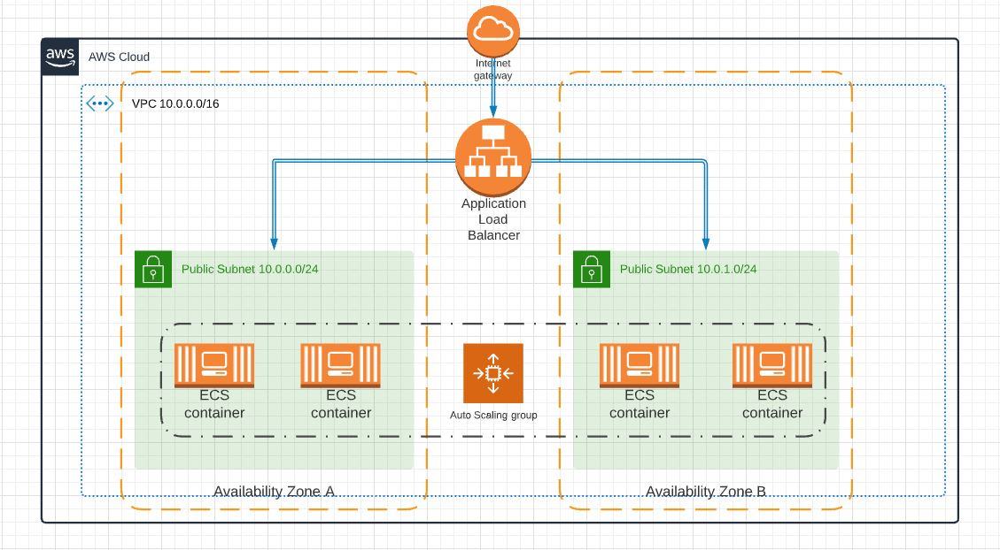

# Provisioning ECS, VPC,  and ALB using Terraform 

 
This is an example that implies that you have already an AWS account and Terraform CLI installed in your Linux or Windows system. 
The users can deploy their own app/website via this infrastructure (variable.tf allows to change name of the Image. In this example used by AWS Elastic Container Repository. 
 
It consit of: 
1 Virtual Private Cloud 10.0.0.0/16 
2. Application Load Balancer 
3. Internet Gateway routed to our ALB 
4. Distributed public subnets (10.0.0.0/24, 10.0.1.0/24) 
5. 2 EC2 instances assigned to the ECS Cluster with ssh access 
6. Tasks definitions (containers) 
7. Autoscaling group that automate availability of our EC2 instances 
8. The subnets distributing into two divided AZ 
 
In this repository, each file is distributed to better defining what we want to build (or change). 
The file variables allow changing the capacity of the desired configuration for the infrastracture. 

## Step by step provisioning  deploy the infrastructure from Terraform code in AWS cloud? 
git clone https://github.com/idyakov/Terraform_AWS_ECS_cluster 
cd Terraform-AWS-ECS-cluster 
Before the start of the deployment, please add to the console your Credentials of AWS an account!=y 
(Environment Variables - Windows OS) 
$env:AWS_ACCESS_KEY_ID= 
$env:AWS_SECRET_ACCESS_KEY= 
$env:AWS_DEFAILT_REGION= 

(Environment Variables - Linux OS) 
AWS_ACCESS_KEY_ID= 
AWS_SECRET_ACCESS_KEY= 
AWS_DEFAILT_REGION= 

terraform init 
terraform plan 
terrafrom apply 
 
Note: it can take about 4-5 minutes to provision all resources. 

After deployment you will see the link of the website, now you can click on the link and you will see the Test page  

## How to delete the infrastructure? 
terraform destroy 

## For reference: 
Cluster using container Instances (EC2 launch type) 
SSH connection allows you to do troubleshooting or update within EC2 instances 
In this repository all files are distributed, to better defining what we want to build (or change) 
The file variables allow changing the capacity of the desired configuration for the infrastracture 
